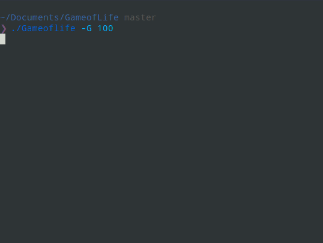

# GameofLife



### Getting Started

```
    go run Gameoflife.go
```

### Arguments

```
  -G int
        set number of generation(Default 50)
  -S int
        set state (0-3)
		    0 - random  < Default
		    1 - Blinker
			2 - Toad
			3 - Glider
```
